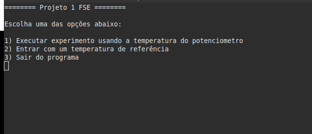
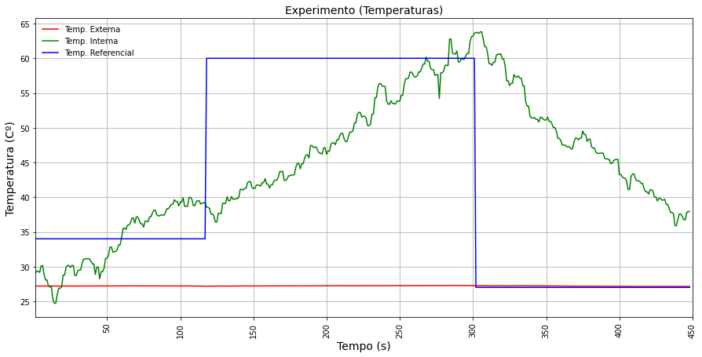
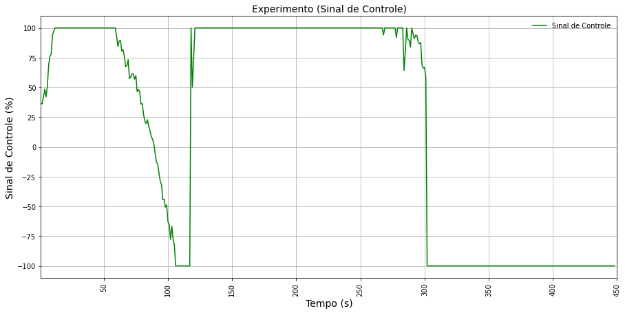
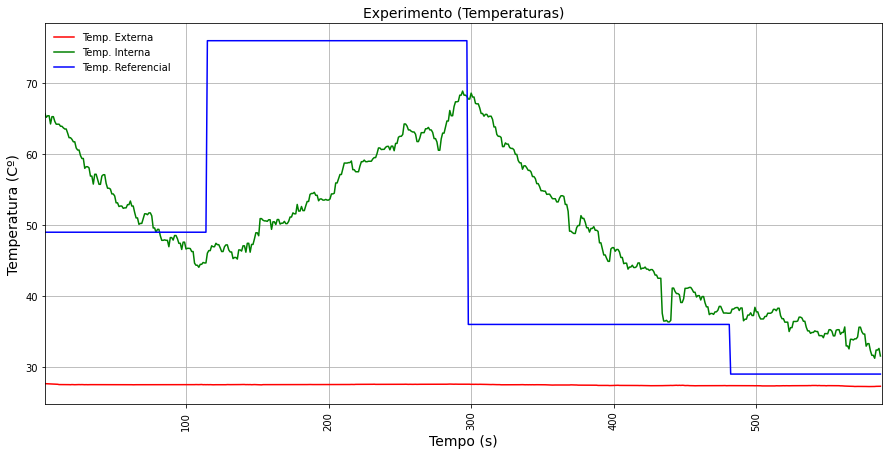
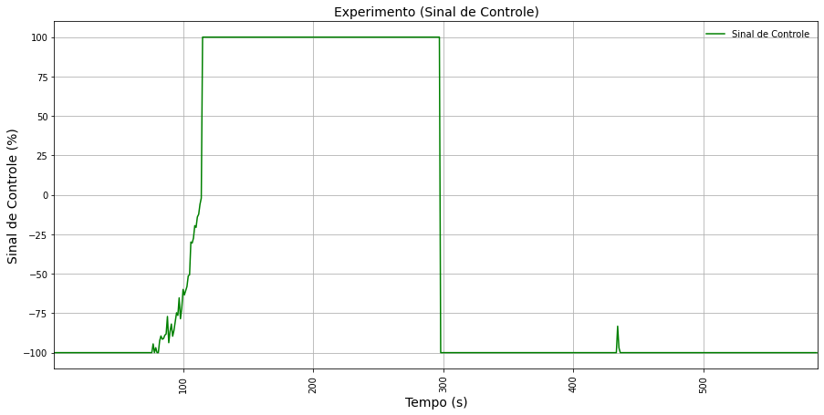

## Trabalho 1 Fundamentos de Sistemas Embarcados

### 1) Dados do Aluno:

- **Nome:** Jôberth Rogers Tavares Costa
- **Matricula:** 16/0128013

### 2) bibliotecas usadas

- **bme280**
- **wiringPiI2C**
- **wiringPi**
- **softPwm**

### 3) Instruções para executar

- Primeiramente clone esse repositório e acesse o diretório **projeto-1-2020.2**

- No diretório há um arquivo **Makefile** com os comandos necessários para compilar e executar o programa. São eles:

    - **make all**: compila os arquivos do diretório
    - **make run**: executa o binário criado
    - **make clean**: remove os binários

### 4) Funcionalidades

- O usuário do programa pode escolher uma entre as três opções presentes:
    - **opção 1:** O usuário usa a temperatura do potenciômetro para interagir com o a ventoinha, sensores e resistores.

    - **opção 2:** O usuário entra com uma temperatura de referência para que o programa comece interagir.

    - **opção 3:** O usuário sai do programa.

#### OBS: Para voltar ao menu enquanto o programa está executando, basta usar as teclas "CTRL + C". Onde é gerado um sinal para que retorne ao menu.

### 5) Experimento Executado:

- Para executar o experimento, foram feito várias medidas onde os dados durante a execução foram salvos em arquivos csv. Após a geração dos arquivos, foram plotado gráficos com as medidas.

#### 5.1) Primeira Medição

##### 5.1.1) Gráfico das temperaturas Interna, Externa e de Referência (Primeira Medição)

##### 5.1.2) Gráfico dos sinais de controle (Primeira Medição)

#### 5.2) Segunda Medição
##### 5.2.1) Gráfico das temperaturas Interna, Externa e de Referência (Segunda Medição)

##### 5.2.2) Gráfico dos sinais de controle (Segunda Medição)

### 6) Referências

[PID - Wikipedia](https://pt.wikipedia.org/wiki/Controlador_proporcional_integral_derivativo)  
[Driver da Bosh para o sensor BME280](https://github.com/BoschSensortec/BME280_driver)  
[Biblioteca BCM2835 - GPIO](http://www.airspayce.com/mikem/bcm2835/)  
[Controle do LCD 16x2 em C](http://www.bristolwatch.com/rpi/i2clcd.htm)  
[Biblioteca WiringPi GPIO](http://wiringpi.com)  
[PWM via WiringPi](https://www.electronicwings.com/raspberry-pi/raspberry-pi-pwm-generation-using-python-and-c)